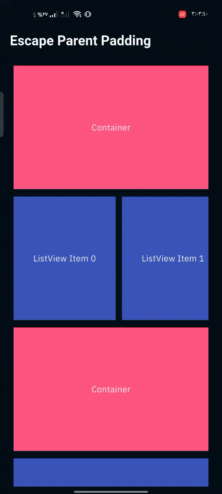
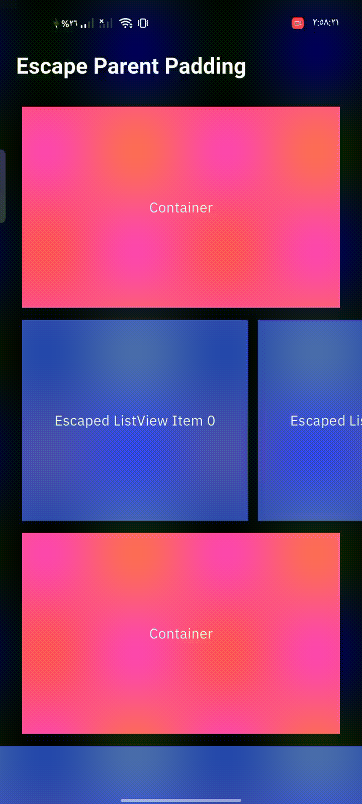

# escape_parent_padding

A lightweight Flutter widget that allows child widgets to visually escape the padding applied by a parent widget. Useful when you want specific widgets (like a horizontally scrolling `ListView`) to ignore parent padding and span the full screen width.

## 🎥 Demo

| Before EscapablePadding | After EscapablePadding |
|--------------------------|-------------------------|
|  |  |

## ✨ Features

- 🧩 Escape parent padding without layout hacks.
- 🪄 Use `EscapablePadding.lite` for simple one-child use cases.
- 🎯 Use `EscapablePadding` with multiple children and custom layouts.
- 🧱 Skip padding for specific children using the `Escaped` widget.

## 🚀 Getting Started

### 1. Add the dependency

In your `pubspec.yaml`:

```yaml
dependencies:
  escape_parent_padding: ^1.0.1
```

Then run:

```bash
flutter pub get
```

### 2. Import the package

```dart
import 'package:escape_parent_padding/escape_parent_padding.dart';
```

## 📦 Usage

### 🔹 Escapable Padding (Multiple Children)

Use this when you want to apply padding to all children **except** specific ones.

```dart
EscapablePadding(
  padding: const EdgeInsets.all(16),
  children: [
    const Text('Padded Item 1'),
    Escaped(
      child: Container(
        color: Colors.red,
        padding: const EdgeInsets.all(8),
        child: const Text('I am not padded'),
      ),
    ),
    const Text('Padded Item 2'),
  ],
  builder: (context, children) => Column(
    crossAxisAlignment: CrossAxisAlignment.start,
    children: children,
  ),
)
```

### 🔸 Lite Mode (Single Escaped Child)

Use this when you want just **one child** to escape horizontal padding.

```dart
Padding(
  padding: const EdgeInsets.symmetric(horizontal: 24),
  child: EscapablePadding.lite(
    height: 100,
    child: Container(
      color: Colors.blue,
      width: 500,
      alignment: Alignment.center,
      child: const Text('I escape the parent padding!'),
    ),
  ),
)
```

## 📁 Example

For a full working sample, see the [example/](example/) folder.

---

## 📌 Additional Information

- Built for simplicity and clean layouts.
- Works well inside `Column`, `ListView`, and other layout widgets.
- Lightweight with no dependencies.

## 🤝 Contributing

Contributions are welcome! If you find a bug or want a feature, open an issue or PR on GitHub.

## 📄 License

MIT License. See the LICENSE file for more info.
